# Style Besda

## External links
* [Live application](http://52.91.103.90)
* [Front-end GitHub repository](https://github.com/kydva/style-besda-front) 

## Project goals
* Help people organize their wardrobe
* Help people choose outfits and clothes to buy with personalized suggestions
* Create an platform for people to share their own outfit ideas

## Used technologies
  * ### Back-end
    - [Typescript](https://www.typescriptlang.org/)
    - [Node.js](https://nodejs.org/)
    - [Express](https://expressjs.com/)
    - [MongoDB](https://www.mongodb.com/)
    - [Redis](https://redis.io/)
    - [AWS S3](https://aws.amazon.com/s3/?nc1=h_ls)
  * ### Front-end
    - [Vue.js](https://vuejs.org/)

## Pre-requisites
  * Install Node.js v16.8.0
  * Install Typescript
  * Install MongoDB
  * Install Redis
  * Create S3 bucket
  
## Getting started
Clone the back-end repository 
```
git clone https://github.com/kydva/style-besda
```
Install dependencies  
```
cd style-besda
npm install
```
Rename [.env.example](/.env.example) to .env and fill it out

Build and run the back-end application  
```
npm run dev
```
Open a new terminal and clone the front-end repository 
```
git clone https://github.com/kydva/style-besda-front
```
Install dependencies  
```
cd style-besda-front
npm install
```
Build and run the front-end application 
```
npm run serve
```

Navigate to http://localhost:8000

## Testing

This project uses [Jest](https://jestjs.io/) for testing   

To run tests, use ```npm run test```
`
## Screenshots

<h3 align="center">Desktop</h3>

 Main page                 |  Wardrobe           
:-------------------------:|:-------------------------:
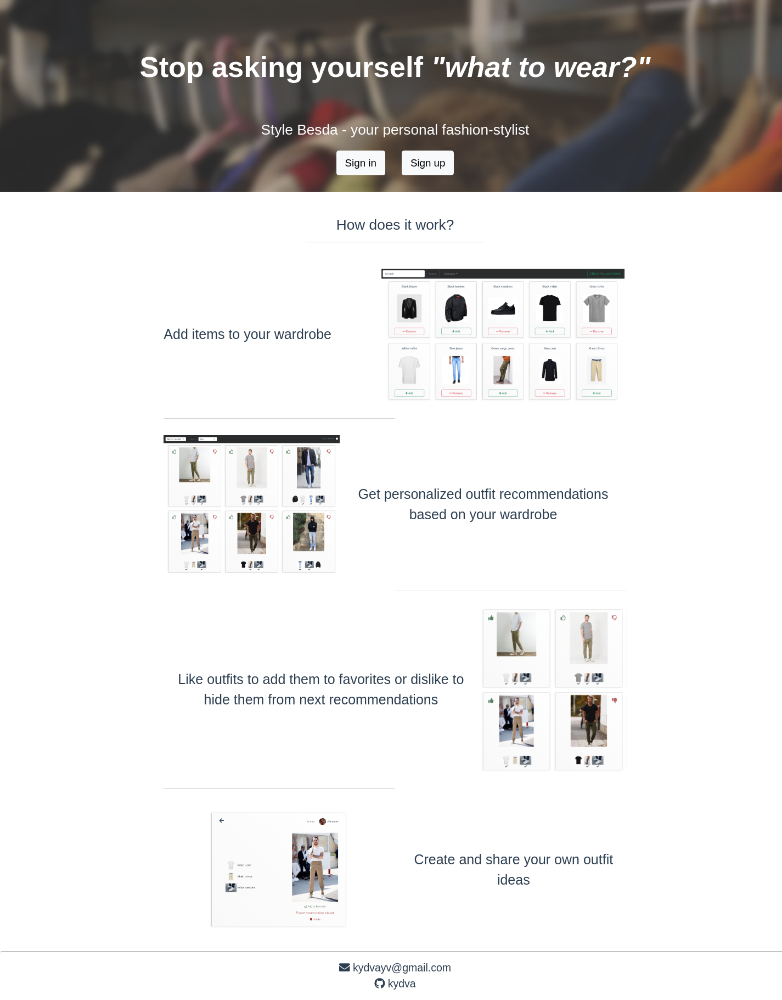     |  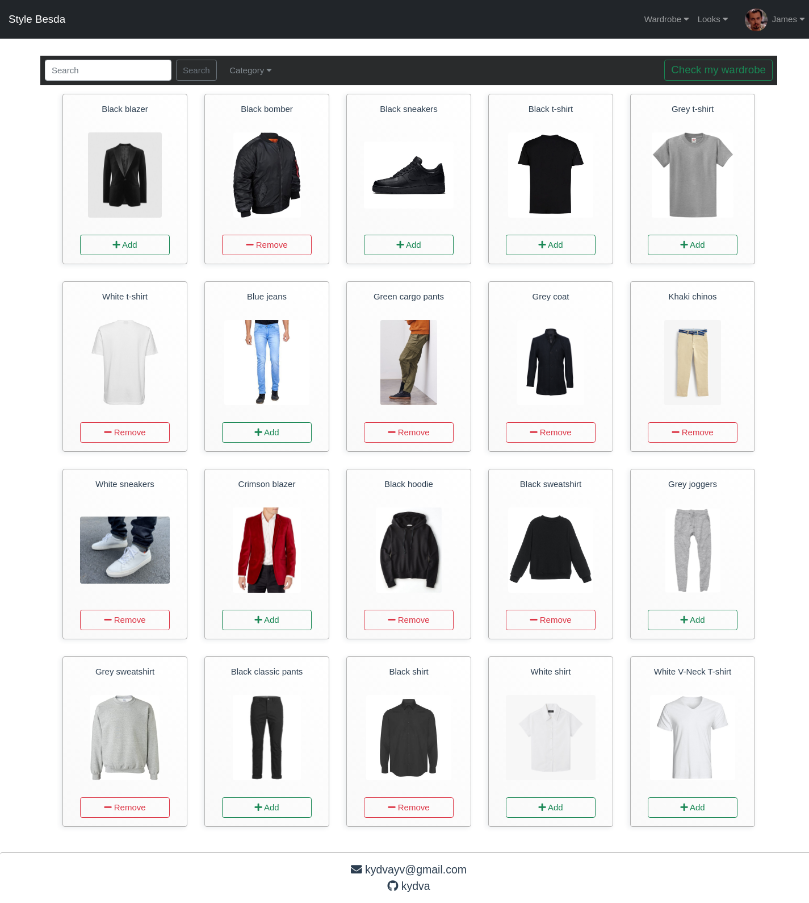

 Look                      |  Recommendations       
:-------------------------:|:-------------------------:
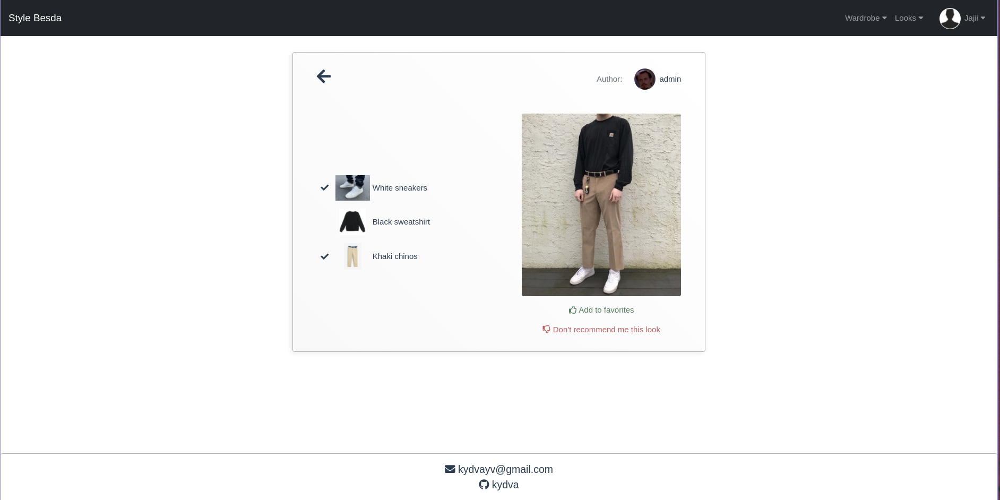     |  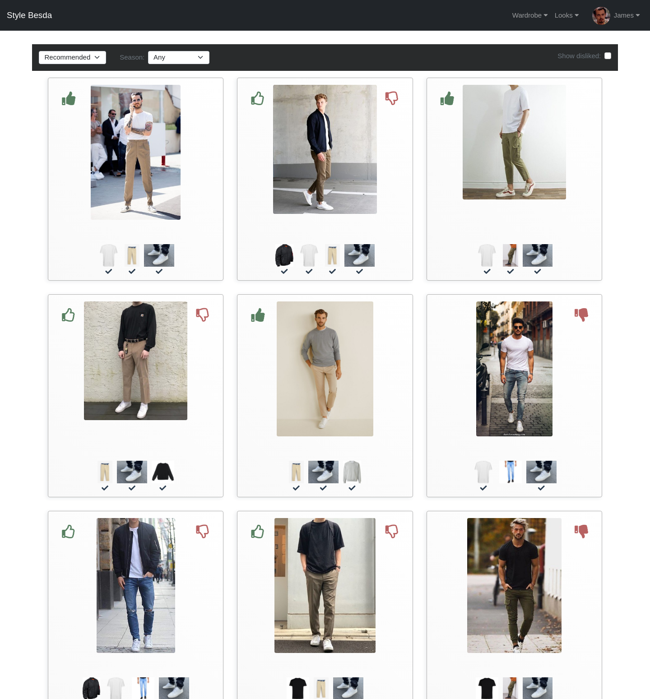

 Profile settings          |  Profile            
:-------------------------:|:-------------------------:
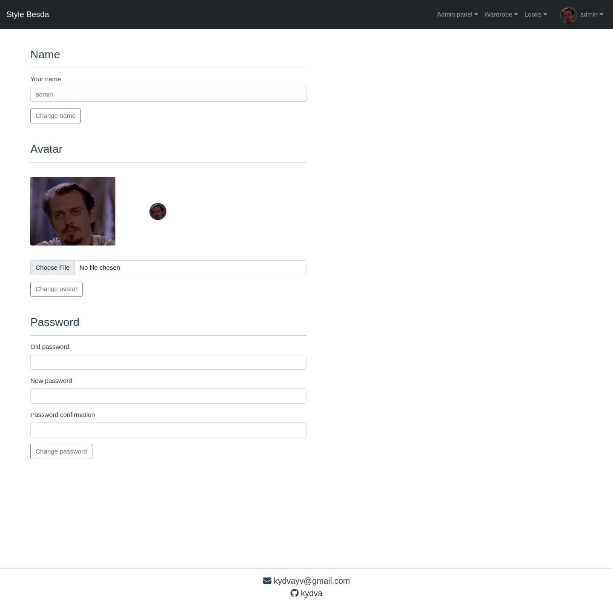     |  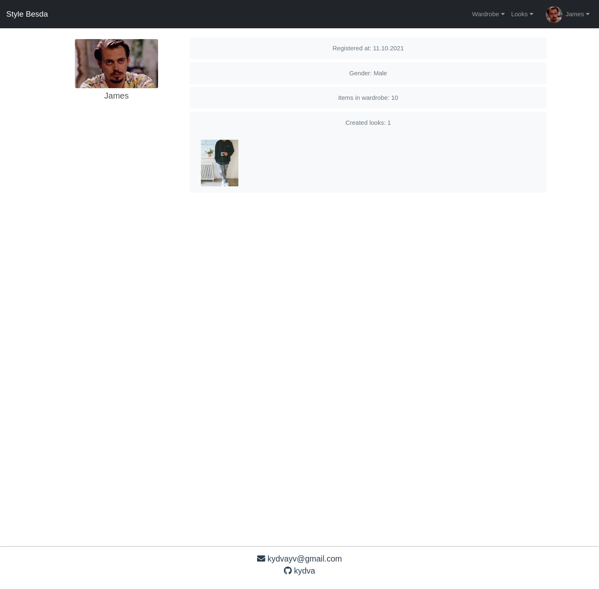

<h3 align="center">Mobile</h3>

 Main page (1)               |  Main page (2)          
:---------------------------:|:-------------------------:
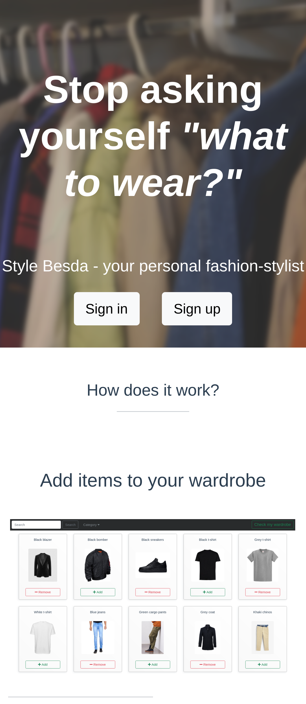|  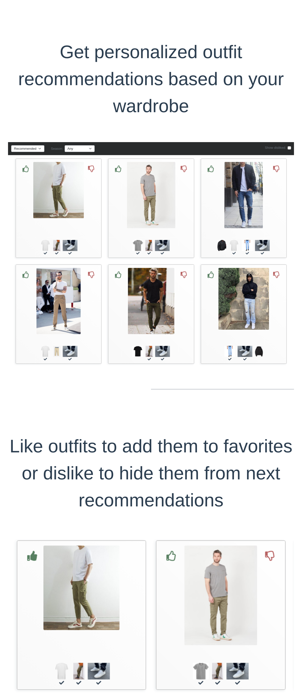

 Main page (3)               |  Sign up
:---------------------------:|:-------------------------:
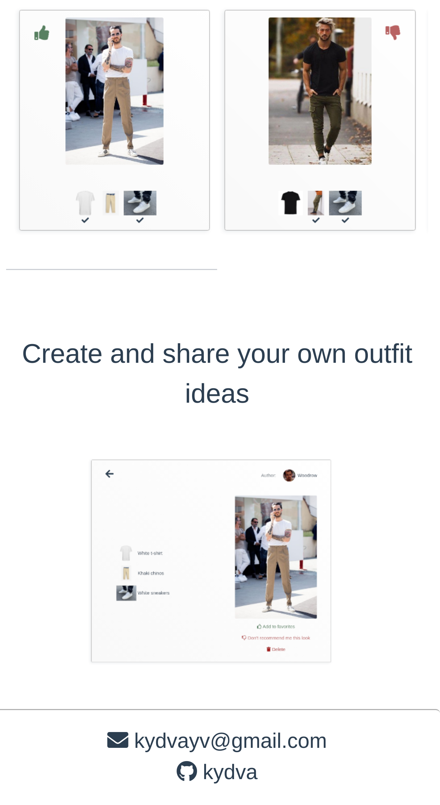|  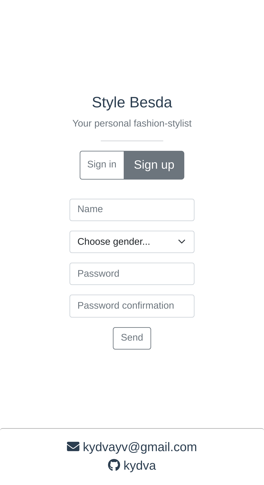

 Burger menu                 |  Wardrobe      
:---------------------------:|:-------------------------:
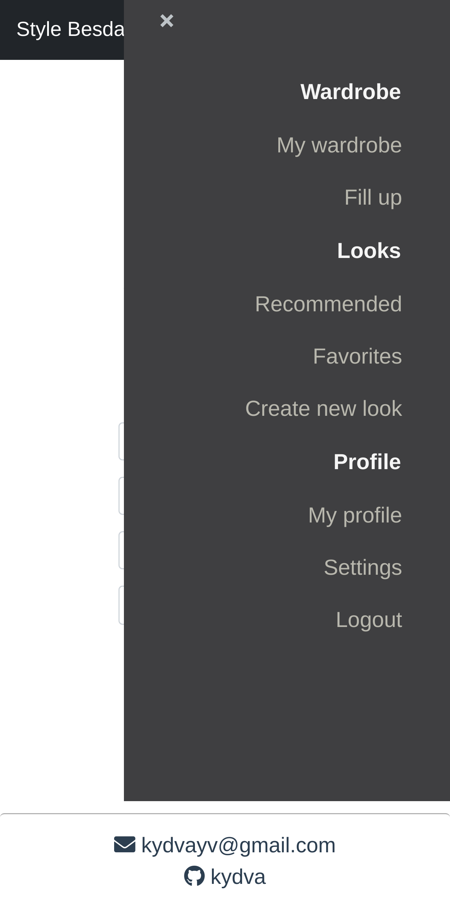|  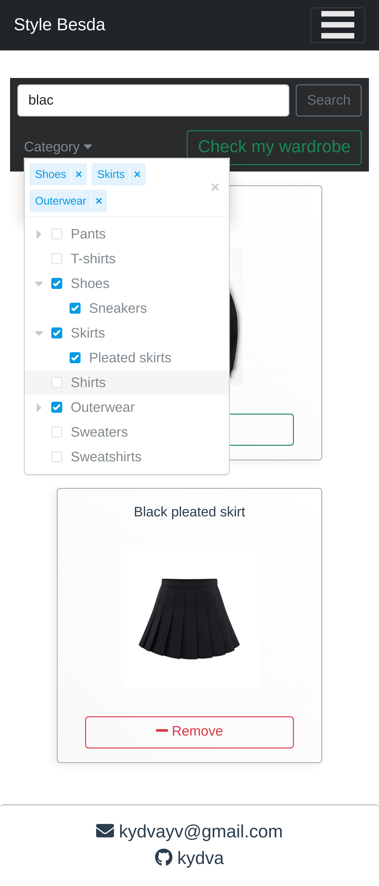

 Recommendations             |  Profile        
:---------------------------:|:-------------------------:
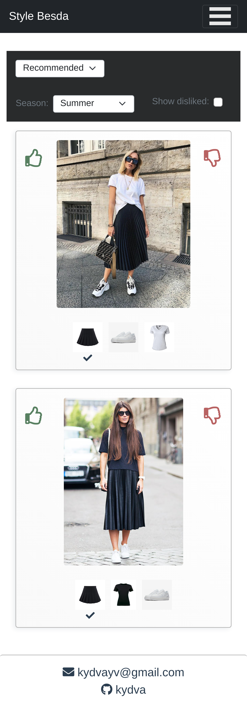|  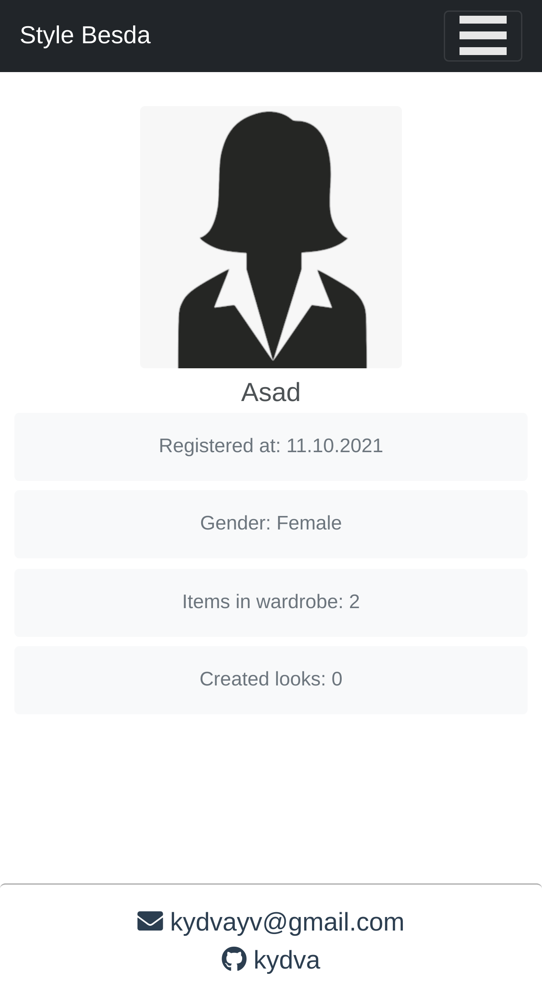


